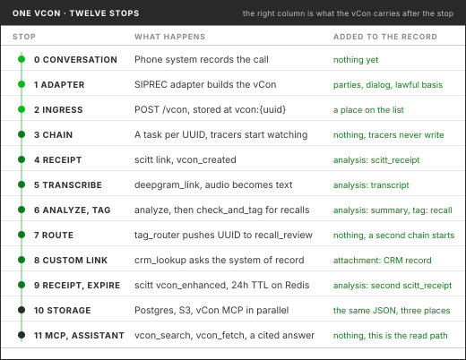

# Day In the Life of a vCon

The easiest way to understand a conserver is to follow one conversation through it. This page
does that. A customer calls a car dealership's service line, and we watch the record of that call
travel from the phone system to an AI assistant answering a manager's question about it a week
later, picking up a transcript, a summary, a tag, a CRM record and two signed receipts on the way.

The same trip is drawn as a conveyor belt in
[The Journey of a vCon](/conserver/vcon-conveyor-infographic.md). The station names below match
that picture, so you can read the two side by side.

For the example, assume a conserver is running with one chain configured for the service line. The
chain records the vCon on a transparency ledger, transcribes it, summarizes it, checks whether the
customer mentioned a safety recall, routes the ones that did to the service team, looks the caller
up in the CRM, and stores the finished record in Postgres, S3 and the vCon MCP server. Every step
is a configuration choice. None of it is code the dealership wrote.

<figure><figcaption>One conversation, twelve stops. The adapter builds the vCon, the chain grows it, storage keeps it, the MCP server answers questions about it.</figcaption></figure>

## 0. The conversation

A customer calls the dealership about a noise from the front of her car. The service advisor
answers. The call is recorded, and the recording announcement at the start of the call tells her
so. Nothing about this is special yet. The phone system holds an audio file and some SIP
signaling, in whatever format the phone system prefers, and if nothing else happened that is where
the conversation would stay.

## 1. The adapter

The phone system forks the call to a SIPREC recording server, and a
[SIPREC adapter](/tools/vcon-siprec-adapter.md) is listening there. When the call ends, the
adapter builds the vCon.

It creates a `parties[]` entry for the customer and one for the advisor, each carrying the SIP
address, contact and display name that the signaling revealed. It creates a `dialog[]` entry of
type `recording` that points at the audio by URL and carries a SHA-512 hash of the file, so the
recording can live in object storage while the vCon stays small. It files the raw INVITE, the SDP
and the STIR/SHAKEN PASSporT as attachments, each marked with a `purpose` such as `sip-invite` or
`stir-passport-extended`, and declares `sip-signaling` in `extensions[]`.

Then it adds the attachment that governs everything downstream: a `lawful_basis` record. The basis
is `consent`, the proof mechanism is the recording announcement at `dialog_index` 0, the
`purpose_grants[]` say what the dealership may do with this conversation (`recording`,
`transcription` and `analysis`, each `granted: true`) and there is an expiration date. The
permission now travels with the conversation instead of sitting in a policy document.

The adapter assigns the vCon a v4 UUID. That UUID is the conversation's name for the rest of its
life. Adapters are source specific. Nine are published in vcon-dev today, for Twilio, SignalWire,
SIPREC, Sippy, ElevenLabs, audio file drops, laptop capture, AI agent sessions and an MCP session
proxy, plus a template for writing your own. Each speaks one platform's dialect and emits the same
container. See [vCon Adapters](/vcon-adapters/README.md).

## 2. Onto the belt

The adapter posts the vCon to the conserver:

```
POST /api/vcon?ingress_lists=service_calls
x-conserver-api-token: ...
```

The conserver stores the JSON in Redis under the key `vcon:{uuid}` and pushes the UUID onto the
`service_calls` list. An external partner with a scoped key can do the same through
`POST /vcon/ingress`, which takes a list of UUIDs for vCons already in Redis and can write only to
the list its key is scoped to.

From here the vCon is never passed between processes. Every link reads it from Redis and writes it
back to Redis, which matters when the dialog holds an hour of audio. The list is durable buffering.
If ten thousand calls end at five o'clock, the list absorbs them and workers pull at their own pace.
See [API](/conserver/api.md).

## 3. The chain

On its next tick the conserver reads the `service_calls` list, finds the new UUID and creates a
task for it. The chain configured on that list is an ordered set of links, written in YAML:

```yaml
chains:
  service_calls:
    ingress_lists: [service_calls]
    links:
      - ledger_created
      - transcribe
      - summarize
      - recall_check
      - recall_route
      - crm_lookup
      - ledger_enhanced
      - expire
    storages: [postgres, s3, vcon_mcp]
    egress_lists: [service_done]
    timeout: 600
```

Each link takes the UUID, does one thing to the vCon, and returns the UUID to continue or nothing
to stop. Because links take and return the same thing, order is a configuration choice and so is
vendor. Change the YAML, `POST /config`, and the next vCon takes the new route. No redeploy.

Before the first link runs, the chain's tracers fire once with a link index of -1 to record the
starting state. A tracer watches. It never writes to the vCon. The documented one is the JLINC
tracer, which signs a record of each transition, hashes the vCon as it stood, and files the result
in an external archive. It fires again after every link and once more when the chain completes.
See [Conserver Tracers](/conserver/conserver-tracers.md).

## 4. The first receipt

The first link is `scitt`, configured with `vcon_operation: vcon_created`. It signs a statement
about the vCon with the conserver's key, registers it on a SCITT transparency service, and gets
back a COSE receipt. With `store_receipt: true` the receipt is written into the vCon as an
`analysis[]` entry of type `scitt_receipt`, carrying the ledger `entry_id`, the `cose_receipt` and
the statement's subject.

That is the first entry in the conversation's lifecycle. Anyone holding the vCon later can prove it
existed at this moment and has not been altered since, without trusting whoever stored it. See the
[Lifecycle extension](/extensions/lifecycle.md).

## 5. Transcription

The second link is `deepgram_link`. It reads the recording from the dialog, skips it if the audio
is shorter than `minimum_duration`, sends it to Deepgram's `nova-2` model with language detection
on, and writes the result into `analysis[]`: the full text, timed segments and confidence scores,
with `vendor` and `product` recorded so a reader knows what produced it.

Audio is opaque. Text is searchable, summarizable, redactable and auditable. This is the moment the
conversation becomes data.

Swapping the vendor is an edit to the YAML. `groq_whisper`, `hugging_face_whisper`,
`openai_transcribe` and the local `transcribe` link all write the same kind of entry, and
`wtf_transcribe` writes the [WTF transcription format](/extensions/wtf-transcription.md) through the
vfun service. If the vCon already carries a transcript the link notices and skips the work, which is
what makes reprocessing a chain cheap.

## 6. Analysis and tagging

The third link is `analyze`, with a summary prompt. It reads the transcript out of `analysis[]`,
sends it to the configured model, and writes a `summary` analysis back. Customer reports a grinding
noise from the front wheels at low speed, about 30,000 miles, advisor booked an inspection for
Thursday.

The fourth link is `check_and_tag`, configured with the `evaluation_question` "Does the customer
mention a safety recall or a recall notice they received?" and a tag of `recall: true`. The model
reads the transcript, answers yes, since the customer said she had a recall letter in the glove box
and wondered whether it was related, and the link writes the tag into the vCon's `tags` attachment.
If the answer had been no, the link would have added nothing and the chain would have carried on.

This is the old "recall finder" from the first version of this page, done without writing a link.
Every question the business wants asked of every call is one `check_and_tag` entry in the YAML.

## 7. Routing

The fifth link is `tag_router`, with a route that maps the `recall` tag to a Redis list called
`recall_review` and `forward_original: true`. It pushes the UUID onto `recall_review` and returns
it, so the main chain continues. The conversation is now on two belts at once.

A second chain reads `recall_review`. In this deployment it has one link, `webhook`, which POSTs
the whole vCon to the service scheduler's intake endpoint so the recall gets checked while the car
is in for the noise. It could as easily have been `post_analysis_to_slack` with a template built
from the summary, or a `jq_link` filtering for a particular model year. A chain's egress list is
another chain's ingress list, and that is how long processes are built out of short ones.

## 8. The custom link

The sixth link is the dealership's own. `crm_lookup` is forty lines of Python following the
[custom link template](/conserver/creating-custom-links.md). It reads the customer's number from
`parties[]`, asks the CRM what it knows, and writes the answer back as an attachment carrying the
account number, the vehicle's VIN, the open repair order and the customer's assigned advisor,
with the party index that says who it refers to.

Three moves: read an identifier from the vCon, ask the system that owns it, write what comes back
into the vCon. The next link, the storage layer, and the manager's assistant a week from now all
read the CRM answer out of the record rather than asking the CRM again. One lookup, many readers.

## 9. The second receipt and the cleanup

The seventh link is `scitt` again, this time with `vcon_operation: vcon_enhanced`. The vCon has
grown by a transcript, a summary, a tag and a CRM record since the first receipt, and this signs
the new state. Two receipts in `analysis[]` now bracket the chain's work.

The last link is `expire_vcon`, which sets a 24 hour TTL on the Redis key. The working copy in
Redis is a cache, and this is how it is kept from growing without bound. The record itself is
about to land somewhere permanent.

## 10. Storage

The chain is finished, so the conserver writes the vCon to every storage configured on it, in
parallel by default. `postgres` writes a row to the `vcons` table with the full document in a
JSONB column, the subject and the timestamps. `s3` writes the file to `{path}/2026/09/02/{uuid}.vcon`
by creation date. `vcon_mcp` POSTs the vCon to a running vCon MCP server's REST API, which puts it
in the Supabase database that AI assistants will read from.

Then the UUID is pushed onto the `service_done` egress list for anything that wants to run next.
Fourteen storage backends ship with the conserver, from Elasticsearch and Milvus to Microsoft
Dataverse and a SCITT storage that registers the finished vCon on the ledger without writing the
receipt back. One write, many destinations, each tuned to a different reader. See
[Storage](/conserver/storage.md).

Had any link thrown an exception, or the chain run past its 600 second timeout, the UUID would have
gone to `DLQ:service_calls` instead, where it waits seven days for someone to inspect it and
`POST /dlq/reprocess` sends it back through. Nothing is dropped silently.

## 11. The MCP server

The conserver's work is done. It processed the conversation once, on arrival, whether or not anyone
ever asks about it. Asking is the [vCon MCP server](/mcp-server/README.md)'s job.

The MCP server is the read path over the same store. It exposes 46 tools over the Model Context
Protocol, so an AI assistant can search conversations by metadata, by keyword, by meaning, or by
a hybrid of the two, then fetch one record or one component of one. It reads Redis first and
falls back to Postgres, so a conversation someone looked at a moment ago comes back in a couple of
milliseconds. Nothing is copied between the two systems. The conserver decides what the record
becomes. The MCP server decides what can be asked of it. See
[MCP and Conserver Together](/mcp-server/mcp-and-conserver-together.md).

## 12. The assistant

A week later the service manager asks her assistant, in plain English, which customers mentioned a
recall in the last seven days and whether each one has a repair order open.

The assistant calls `vcon_search` with the `recall` tag and a date range, gets a page of results
with our vCon among them, and calls `vcon_fetch` on it asking for `summary`, `parties` and
`attachments`. The summary tells it what the call was about. The CRM attachment tells it the repair
order number and the advisor. The lawful basis attachment tells it that analysis was granted, so the
answer it is about to give is one it was allowed to compute. It answers with the customer's name,
the Thursday appointment, the open repair order and a citation back to the call.

Nobody built an integration for that question. The conversation was already a first class record,
and the assistant read it the way it reads a file.

## What the vCon carries now

| Section | What is in it | Who put it there |
| ------- | ------------- | ---------------- |
| `parties[]` | Customer and advisor, with SIP address, contact and display name | Adapter |
| `dialog[]` | The recording, by URL, with a SHA-512 hash | Adapter |
| `attachments[]` | INVITE, SDP, STIR PASSporT (`purpose: sip-*`) | Adapter |
| `attachments[]` | `lawful_basis`: consent, purposes granted, proof, expiration | Adapter |
| `analysis[]` | `scitt_receipt` for `vcon_created` | `scitt` link |
| `analysis[]` | Transcript with timed segments and confidences | `deepgram_link` |
| `analysis[]` | Summary | `analyze` link |
| `attachments[]` | `tags`: `recall: true` | `check_and_tag` link |
| `attachments[]` | CRM account, VIN, open repair order, advisor | Custom link |
| `analysis[]` | `scitt_receipt` for `vcon_enhanced` | `scitt` link |
| `extensions[]` | `sip-signaling`, `lawful_basis`, `lifecycle` | Adapter and chain |

The record only grew. No link rewrote what an earlier one had written, which is what makes the
account of the conversation part of the conversation. And the same JSON is in Postgres, in S3 and
behind the MCP server, byte for byte, with two receipts that prove it.

## Some months later

The customer sells the car and asks the dealership to delete her recordings. The dealership records
a `vcon_consent_revoked` event on the transparency ledger, then calls `DELETE /vcon/{uuid}`, which
removes the vCon from Redis and from every configured storage. It records `vcon_deleted` on the
ledger. The vCon is gone. The proof that it existed, that consent was given and later withdrawn,
and that deletion happened, stays on the ledger forever. When a regulator asks what happened to
that conversation, the answer comes from the ledger rather than from reconstructed logs.

## The point

Each station alone is useful. Together they turn a phone call that would have sat in a recording
bucket nobody opened into a record the business and its AI can use, and can prove. The adapter
ends vendor lock in. The queue guarantees nothing is lost. Transcription turns audio into data.
The chain compounds value one link at a time, inside your security boundary. Storage serves every
reader. The MCP server carries the result to where decisions are now being made. The receipts and
the lawful basis attachment mean every one of those readers can trust what they are looking at.

## Where to go next

* [Conserver Introduction](/conserver/conserver-introduction.md) explains the five primitives
  this page walks through.
* [Standard Links](/conserver/standard-links.md) is the reference for all 22 shipped links,
  including every option used above.
* [Creating Custom Links](/conserver/creating-custom-links.md) is how `crm_lookup` gets written.
* [Configuring the Conserver](/conserver/configuring-the-conserver.md) covers the chain YAML in
  full.
* [Lawful Basis](/extensions/lawful-basis.md) and [Lifecycle](/extensions/lifecycle.md) are the
  two extensions that make the record governable.
* [The Journey of a vCon](/conserver/vcon-conveyor-infographic.md) is this page as a picture.
