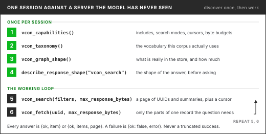

# 📜 Contract Tools

The contract tools are seven tools added in May 2026 for LLM clients that know nothing about the
server in advance: `vcon_capabilities`, `vcon_taxonomy`, `vcon_graph_shape`,
`describe_response_shape`, `vcon_fetch`, `vcon_search` and `vcon_aggregate`. They share one
response envelope, page with a cursor, and refuse a response that would exceed a byte budget
instead of truncating it. Parameters for each are in the [Tool Reference](tool-reference.md).

## Why they exist

The older tools assume the client already knows the server. A model does not. It does not know
which tag keys a deployment uses, it cannot tell in advance how big an answer will be, and it
handles offset paging badly. The contract tools let the server describe itself so the model can
plan its queries.

<figure><figcaption>Discovery calls once per session, then the search and fetch loop.</figcaption></figure>

## The envelope

Every contract tool answers in one of three shapes.

A single item:

```json
{
  "ok": true,
  "item": { "id": "6f1c...", "subject": "Billing question" },
  "meta": { "include": ["core", "summary"], "approximate_bytes": 612, "max_response_bytes": 250000 }
}
```

A list:

```json
{
  "ok": true,
  "items": [ { "id": "6f1c...", "subject": "Billing question" } ],
  "page": { "count": 25, "total": 812, "next_cursor": "eyJvZmZzZXQiOjI1fQ" },
  "meta": { "approximate_bytes": 18044 }
}
```

A failure:

```json
{
  "ok": false,
  "error": {
    "code": "RESPONSE_TOO_LARGE",
    "message": "Response would be 412000 bytes, exceeding the 250000 byte budget.",
    "approximate_bytes": 412000,
    "max_response_bytes": 250000,
    "suggestions": ["Reduce include to [\"core\",\"summary\"] or [\"core\",\"summary\",\"dealer\"]."]
  }
}
```

Successful fetch and search responses carry `meta.approximate_bytes`, so a client can calibrate
the next request. When a search page holds fewer items than `limit`, `meta.short_page_reason` says
whether more pages exist.

### Error codes

| Code | Raised by | Meaning |
| ---- | --------- | ------- |
| `INVALID_ARGUMENT` | fetch, search, aggregate | A missing `id`, an unsupported `include` value, a `max_response_bytes` below 1024, a missing `query` in `keyword` or `hybrid` mode, an embedding that is not 384 numbers, a `group_by` other than `dealer` |
| `NOT_FOUND` | fetch | No vCon with that ID |
| `FETCH_FAILED` | fetch | The read failed for another reason |
| `SEARCH_FAILED` | search | The query failed |
| `AGGREGATE_FAILED` | aggregate | The rollup failed, for example because the RPC is missing |
| `SHAPE_GRAPH_FAILED` | graph shape | The shape graph could not be built |
| `RESPONSE_TOO_LARGE` | fetch, search | The response would exceed `max_response_bytes`. The error carries `approximate_bytes`, `max_response_bytes` and `suggestions` |

A malformed `cursor` is rejected as an MCP invalid-params error, outside the envelope.

## Discovery tools

### `vcon_capabilities`

What this server supports. The item has these keys:

* `tools`: the seven contract tool names.
* `shape_graph`: the resource URI `vcon://v1/graph/shape`, the tool name and the schema ID.
* `response_budgeting`: default `max_response_bytes` (250,000), minimum (1,024), and the failure code.
* `fetch`: identifier field `id`, default includes `core`, `parties`, `summary`, and the supported include groups `core`, `parties`, `summary`, `tags`, `dealer`, `counts`, `dialog`, `analysis`, `attachments`.
* `search`: the four modes, default mode `metadata`, default includes `core`, `summary`, default limit 25, maximum 100.
* `pagination`: cursor strategy and how `page.total` and `page.iterable_total` behave.
* `taxonomy_hints` and `migration`: tag hints, and the contract tool that replaces each legacy read tool.

### `vcon_taxonomy`

A fixed guidance payload written for one deployment's dealer-call dataset. Its keys are
`portal_values` (three values of a `portal` tag), `common_tags` (the `portal` and `dealer_name`
tag keys), `preferred_sources` (where to find dealer, summary and bad-call data),
`query_recipes`, and `coverage`, the one live part: the share of vCons that carry the dealer
attachment and the `dealer_name` tag. It is not derived from your store. On any other corpus use
`vcon_graph_shape`. The `public` tool profile disables it.

### `vcon_graph_shape`

What is actually in this store, built from vCon structure alone. The same payload is served as the
resource `vcon://v1/graph/shape`; clients that support resources should read that.

```json
{
  "schema_version": "1.0.0",
  "generated_at": "2026-10-06T14:00:00Z",
  "corpus": { "vcons_with_tags_mv": 12483, "notes": [] },
  "nodes": [
    { "id": "analysis_type:summary", "kind": "analysis_type", "label": "summary", "vcon_count": 12210 },
    { "id": "attachment_purpose:tags", "kind": "attachment_purpose", "label": "tags", "vcon_count": 12483 },
    { "id": "tag_key:department", "kind": "tag_key", "label": "department", "vcon_count": 821 }
  ],
  "edges": [
    {
      "id": "edge:analysis_type_with_attachment_purpose:summary:tags",
      "kind": "analysis_type_with_attachment_purpose",
      "source": "analysis_type:summary",
      "target": "attachment_purpose:tags",
      "joint_vcon_count": 12100
    }
  ]
}
```

Node kinds are `analysis_type`, `attachment_purpose`, `attachment_type_legacy` (attachments with a
`type` and no `purpose`) and `tag_key`. The one edge kind counts vCons in which an analysis type and
an attachment purpose occur together. The numbers above are illustrative.

### `describe_response_shape`

Given `tool_name`, returns the JSON Schema of that tool's response and, unless
`include_example` is false, an example payload. It covers the seven contract tools and the legacy
read tools `get_vcon`, `search_vcons`, `search_by_tags`, `search_vcons_content`,
`search_vcons_semantic` and `search_vcons_hybrid`. Without `tool_name` it lists those tools.

## Working tools

### `vcon_fetch`

Fetches one vCon by `id` and returns only the include groups asked for, `core`, `parties` and
`summary` by default. `dialog`, `analysis` and `attachments` carry full bodies and are the usual
cause of `RESPONSE_TOO_LARGE`. `dealer` returns the parsed `strolid_dealer` attachment where a
deployment stores one, and null otherwise.

### `vcon_search`

One search tool for four modes.

* `metadata`, the default: filters only. `filters` takes `subject`, `start_date`, `end_date`, `party_name`, `party_email`, `party_tel`, and `dealer_id` (exact) or `dealer_name` (case-insensitive substring) where a deployment stores the dealer attachment.
* `keyword`: Postgres full text search. Requires `query`.
* `semantic`: embedding similarity above `threshold` (default 0.7). Requires `query` or a 384-number `embedding`.
* `hybrid`: keyword and semantic blended by `semantic_weight` (default 0.6). Requires `query`.

`tags` filters apply in every mode, as key and value pairs such as `{"department": "sales"}`. The
tool description tells the model to filter on tags first when the store is tagged.

Results come in pages of `limit` items, 25 by default and at most 100. Pass `page.next_cursor`
back as `cursor` unchanged to get the next page. The cursor is base64url JSON holding an offset, so
if vCons are added or removed between calls a page can skip or repeat items. For tag-filtered
metadata search only the newest 100,000 matches are reachable; when there are more,
`page.iterable_total` says so.

### `vcon_aggregate`

Counts per dealer in one call. For each dealer it returns `baseline_count` (vCons in the group) and
`filtered_count` (those that also match `tags`), so the client divides for a rate. `having.min_count`
drops small groups, `filters.start_date` and `filters.end_date` bound `created_at`, and `limit`
caps the rows, 20 by default and at most 500. It needs the `aggregate_vcons_by_dealer_stats`
database function from migration `20260512180000_vcon_dealer_filter_and_aggregate.sql`, which also
adds the functions behind the dealer filters in `vcon_search`. Only `group_by: "dealer"` exists.
The `public` tool profile disables it.

## A session

```
1. vcon_capabilities()                       limits and include groups, once
2. vcon_graph_shape()                         what the store holds, once
3. describe_response_shape("vcon_search")     response schema, once if needed
4. vcon_search(mode, tags, filters, include)  a page of IDs and summaries
5. vcon_fetch(id, include)                    the parts actually needed
6. repeat 4 and 5
```

## Field names

The contract tools return `critical` and `amended`. They read the normalized tables
directly and do not use the `vcons_legacy` view. See [Field-Name Migration](field-name-migration.md).
