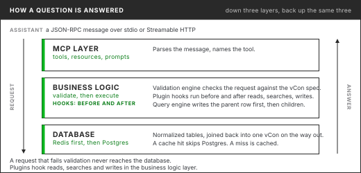

# How the vCon MCP Server is Built

The server is TypeScript on the official MCP SDK, with Supabase Postgres underneath. A request
passes through three layers: the MCP layer that speaks the protocol, a business layer that
validates and runs hooks, and a query layer that reads and writes normalized tables. This page
follows the code at release 1.9.2 of [vcon-dev/vcon-mcp](https://github.com/vcon-dev/vcon-mcp).
For transports, keys and environment variables see
[Transport and Deployment](transport-and-deployment.md).

<figure><figcaption>Down through three layers and back up.</figcaption></figure>

## The MCP layer

`src/server/` registers handlers for listing and calling tools, listing and reading resources, and
listing and getting prompts. On `tools/list` it gathers the 46 built-in tools, drops those the
deployment's profile or the caller's read-only key excludes, and appends any plugin tools. On
`tools/call` it finds the tool's handler in a registry (`src/tools/handlers/`) and runs it, or hands
the call to the plugin that registered the tool.

Resources are read-only views at `vcon://v1/` URIs, for example `vcon://v1/vcons/{uuid}` and
`vcon://v1/vcons/{uuid}/parties`. Prompts are templates that tell a client which tools to call for
a kind of question. Both are listed in the [Tool Reference](tool-reference.md#resources).

## The business layer

### Validation

Every create and append is checked before it reaches the database (`src/utils/validation.ts`):

* the UUID is well formed and `created_at` is a valid date
* there is at least one party, and every party has an identifier
* every dialog type is `recording`, `text`, `transfer` or `incomplete`; an `incomplete` dialog has a `disposition`; a `transfer` dialog has its transfer fields
* every analysis has `type` and `vendor`, and uses `schema`, not `schema_version`
* every encoding is `base64url`, `json` or `none`, and a body with `encoding: "json"` parses
* every analysis and attachment has `body` and `encoding` or `url` and `content_hash`

A failure returns an MCP invalid-params error listing what is wrong. A `critical` entry that is not
in `extensions` is a warning, not a failure. The `vcon` version field is not checked. Index
references from dialog to parties are not checked.

Tool arguments are described as JSON Schema for the client, and the schema `get_schema` returns is
built from Zod definitions in the same code.

### Plugins

A plugin is a module listed in `VCON_PLUGINS_PATH`. It can register tools, handle calls to them,
and implement lifecycle hooks:

| Hook | Runs on |
| ---- | ------- |
| `beforeCreate`, `afterCreate` | `create_vcon`, `create_vcon_from_template`, REST create |
| `beforeRead`, `afterRead` | `get_vcon`, REST get |
| `beforeSearch`, `afterSearch` | `search_vcons` |
| `beforeUpdate`, `afterUpdate` | `update_vcon` |
| `beforeDelete`, `afterDelete` | `delete_vcon` |

The contract tools (`vcon_fetch`, `vcon_search` and the rest), the keyword, semantic, hybrid and
tag searches, the child-edit tools and resource reads run no hooks. A redaction plugin written as
`afterRead` therefore does not cover `vcon_fetch`. This is tracked in
[vcon-mcp#100](https://github.com/vcon-dev/vcon-mcp/issues/100). Plugins can also list resources,
but reads of those URIs are not passed to the plugin.

No plugins ship with the server.

## The query layer

`src/db/queries.ts` talks to Supabase through `supabase-js`, which sends PostgREST HTTP requests.
Searches and rollups call Postgres functions (`rpc`). There are no prepared statements on the
client side and no client-held database connection.

### Writes

Creates go through a batch writer (`src/db/batch-writer.ts`) that groups concurrent creates for up
to 100 vCons or 200 milliseconds per tenant. It upserts the `vcons` rows first, then the parties,
dialog, analysis and attachment rows in parallel. Each PostgREST call is its own transaction, so
there is no transaction around a whole vCon: if a child insert fails, the parent row and any
children already written stay. The caller gets the error and can retry; upserts make a retry
safe.

Edits to one part, such as `add_dialog` or `update_party`, touch that table's rows and then delete
the vCon's Redis entry.

### Reads

A read fetches the `vcons` row and its child rows and reassembles the vCon. Keys that have no
column of their own are kept in each row's `extra` column and merged back, so a vCon reads back with
the keys it was written with. With Redis configured, single-vCon reads check the cache first.

There is no streaming. Large results are controlled with `limit`, pagination and, on the contract
tools, `max_response_bytes`.

### Tables

| Table | Holds |
| ----- | ----- |
| `vcons` | One row per vCon: `uuid`, `subject`, timestamps, `extensions`, `critical`, `amended`, `redacted`, `group_data`, `tenant_id` |
| `parties` | Parties, keyed by vCon and index |
| `dialog` | Dialog entries, keyed by vCon and index |
| `analysis` | Analyses, keyed by vCon and index |
| `attachments` | Attachments, keyed by vCon and index, including the tags attachment |
| `groups`, `party_history` | Group references and party join, drop, hold and mute events |
| `vcon_embeddings` | 384-dimension vectors with the model that produced them |
| `embedding_queue` | vCons waiting for embedding, filled by an insert trigger |
| `privacy_requests`, `s3_sync_tracking`, `migration_reports` | Supporting tables used by scripts and edge functions |

The views are `vcon_tags_mv` (a materialized view with one row per tag) and `vcons_legacy` (old
field names; see [Field-Name Migration](field-name-migration.md)). Migration
`20260611120000_vkong_schema.sql` also creates a separate `vkong` schema for another service; the
MCP server does not use it.

### Search

| Mode | How it runs |
| ---- | ----------- |
| Metadata | Filters on `vcons` and `parties` with B-tree indexes; tag filters go through `vcon_tags_mv` |
| Keyword | `search_vcons_keyword` matches stored `tsvector` columns on subject, parties, dialog bodies and analysis bodies with `plainto_tsquery`. English stemming on text, simple tokens on parties. No typo tolerance |
| Semantic | `search_vcons_semantic` compares the query embedding with `vcon_embeddings` by cosine distance under an HNSW index |
| Hybrid | `search_vcons_hybrid` blends keyword rank and semantic similarity by `semantic_weight` |

Trigram (`pg_trgm`) GIN indexes exist on party `name`, `mailto` and `tel` and on dialog and analysis
bodies. They speed substring filters such as `party_name`; keyword search does not use them.

The query embedding comes from Supabase's built-in `gte-small` by default, or OpenAI
`text-embedding-3-small` at 384 dimensions when `OPENAI_API_KEY` is set. Stored vCons are embedded
outside the write path by an edge function.

### Tags

Tags are one attachment per vCon with `purpose: "tags"` and a JSON array of `"key:value"` strings,
so they stay inside the vCon. `vcon_tags_mv` expands them into rows, and tag filters read the view.
The view is a snapshot. The server refreshes it, when a tags attachment is newer than the view,
before `get_unique_tags` and the `vcon_taxonomy` coverage count; otherwise it is refreshed by hand
or by a scheduled job. Until then a new tag may not match a tag filter.

### Tenancy

Tenancy is set per deployment. With `RLS_ENABLED=true` and `CURRENT_TENANT_ID` set, the server
calls a database function that sets `app.current_tenant_id` on its session, and Row Level Security
policies on every table compare each row's `tenant_id` with it. A tenant ID in a JWT claim takes
precedence. On write, `tenant_id` is taken from the vCon's tenant attachment. One instance serves one
tenant.

## See also

* [What is the vCon MCP Server?](what-is-the-vcon-mcp-server.md)
* [Tool Reference](tool-reference.md)
* [Transport and Deployment](transport-and-deployment.md)
