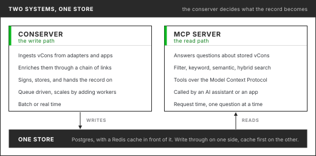

# What is the vCon MCP Server?

The vCon MCP Server is the read path for conversation data. Once a conversation has been
captured, enriched and stored as a vCon, somebody is going to ask a question about it, and
increasingly that somebody is a language model. The server is what the model talks to. It speaks
the Model Context Protocol, exposes the store as a set of tools whose definitions the model reads
before it uses them, and does the validation, filtering and budgeting that a model cannot be
trusted to do for itself.

It is open source under an MIT license, written in TypeScript, and lives at
[github.com/vcon-dev/vcon-mcp](https://github.com/vcon-dev/vcon-mcp). It ships as an npm package
(`vcon-mcp`) and a Docker image, runs over stdio or Streamable HTTP, and sits over a Supabase
Postgres deployment with optional Redis caching and pgvector for semantic search.

<figure><figcaption>Two systems, one store. The conserver writes the record. The MCP server answers questions about it.</figcaption></figure>

## The problem it solves

The [conserver](../conserver/README.md)'s job ends when the record is stored. The question arrives
later. A support lead asks which complaints went up this month. A sales manager asks which deals
have no agreed next step. A compliance officer asks what happened to one call on one afternoon.
Not long ago each of those was a report somebody built. Now each is a sentence typed at an
assistant.

Between the sentence and the store there has to be something, because you cannot hand a model a
database connection. It does not know your schema. It will guess at tag values. It will write a
query that returns forty megabytes into a context window that holds two, and when the query is
wrong it will not know. An MCP server is that something. It publishes what can be asked, in a
form the model reads at the start of every session, checks every request against the vCon
standard, and returns answers in the shape the model was told to expect.

Two open standards meet here. [vCon](../vcons/a-vcon-primer.md) is the record, so what the server
returns is portable and not tied to the system that captured it. MCP is the way the model asks, so
an assistant that has learned to work against one vCon deployment can work against another.
Neither standard is controlled by a single company, and that is the point of building on both.

## MCP in brief

The [Model Context Protocol](https://modelcontextprotocol.io) is an open protocol for connecting
an AI application to outside data and actions. The application (the host, such as Claude Desktop,
Claude Code or Cursor) runs an MCP client that connects to one or more servers over stdio or HTTP
and exchanges JSON-RPC messages. A server offers three things. **Tools** are functions the model
can call, each with a name, a description and a JSON Schema for its arguments. **Resources** are
read-only data at URIs the application can fetch. **Prompts** are templates the user can pick to
start a task. The model reads the tool descriptions at the start of a session and decides which to
call; the host carries out the call and returns the result to the model. The specification and SDKs
are at [modelcontextprotocol.io](https://modelcontextprotocol.io).

## When to use it

* An MCP client, such as an assistant or an agent you are building, needs to read or write vCons.
* Your vCons are in, or can be loaded into, a Supabase Postgres project with this server's schema.
* You want the store's limits enforced on the server: validation on write, byte budgets and
  paging on read, read-only keys and tool profiles for who may do what.

It is not a capture or processing pipeline. Transcription, summarization and other enrichment
belong in the [conserver](../conserver/README.md) or another producer, before the vCon is stored.

## What an assistant can do with it

The server exposes 46 tools in seven groups. An assistant reads the tool definitions and picks
the one that fits the question.

| Group | Tools | What they do |
| ----- | ----- | ------------ |
| vCon CRUD | 17 | Create, fetch, update and delete a vCon; append a dialog, an analysis or an attachment. Any dialog, analysis or attachment can be updated or removed by index, and parties can be added, updated or removed. Templates for a phone call, a chat, an email thread and a video meeting |
| Contract and discovery | 7 | `vcon_fetch`, `vcon_search`, `vcon_capabilities`, `vcon_taxonomy`, `vcon_graph_shape`, `describe_response_shape`, `vcon_aggregate`. Server side rollups, for example by dealer, via `vcon_aggregate`. The surface built for LLM clients, added May 2026 |
| Search, legacy | 4 | Metadata, full text, semantic and hybrid search. Still supported. New work uses `vcon_search` |
| Tags | 5 | Set, remove, list, search by and clear tags. Tags are an attachment with `purpose: "tags"`, materialized in the database so filtering on them is cheap |
| Analytics | 6 | Growth, content, attachment and tag distributions, and health metrics for the corpus as a whole |
| Database inspection | 5 | Shape, statistics, size, search limits and `EXPLAIN` plans |
| Schema and examples | 2 | The vCon JSON Schema and a set of example vCons from minimal to full featured |

Alongside the tools the server publishes read only resources at URIs like `vcon://v1/vcons/{uuid}`
and `vcon://v1/vcons/{uuid}/parties`, and prompts that tell the assistant how to phrase a good query.
The full list, with each tool's parameters, is in the [Tool Reference](tool-reference.md).

## Four ways to search

* **Metadata.** Subject, participant, dates, tags. Indexed columns. Use it when you know what you are looking for.
* **Keyword.** Words in the subject, parties, dialog and analysis, through Postgres full text
  search with stemming, so "refunds" finds "refund". It matches words, not misspellings.
* **Semantic.** Meaning rather than words. Each vCon's subject, dialog and analysis text carries a 384 dimension embedding in
  pgvector under an HNSW index, generated outside the write path so writes never wait on it.
* **Hybrid.** Both at once, merged under a `semantic_weight` you set. The
  best general answer when you are not sure which kind of question you have.

Keyword, semantic, hybrid and tag searches are database functions that run where the data is. The assistant does not need to
know any of this. It needs to know that a literal word wants keyword, a concept wants semantic,
a UUID or a date range wants metadata, and doubt wants hybrid, and the tool descriptions tell it
so.

## Built for a client that does not know the server

Most MCP servers assume the client knows the server's shape ahead of time. When the client is a
model that assumption fails in four ways. The model does not know which extensions this
deployment carries. It cannot guess how this deployment spells a dealer ID or a campaign name. It
needs to know how big an answer will be before the answer arrives, or it overflows its own
context. And it is bad at offset pagination.

In May 2026 the server gained seven [contract tools](contract-tools.md) that fix this
by making the server describe itself.

<figure><figcaption>Four cheap calls at the start of a session, then the working loop.</figcaption></figure>

`vcon_capabilities` returns what this server supports: the field groups a fetch can include, the
search modes, the pagination rules, the byte budgets. `vcon_graph_shape` returns what is really in
the store: which analysis types, attachment purposes and tag keys occur, in how many vCons, and
which travel together. `vcon_taxonomy` returns fixed guidance on tag and attachment conventions
written for one dealer-call dataset, so it is useful only on a store that follows them.
`describe_response_shape` returns the JSON Schema and an example payload for any contract tool, so a
client can plan a multi step query knowing which fields will be there downstream. Then
`vcon_search` and `vcon_fetch` do the work. `vcon_aggregate` returns server side counts grouped by dealer, so the model does not page through records to count them.

Three rules hold across all seven.

* **One envelope.** A single item comes back as `{ok, item}`. A list comes back as
  `{ok, items, page}` with an opaque `next_cursor`. A failure comes back as
  `{ok: false, error: {code, message}}`. The shape never varies with the content.
* **A byte budget, enforced.** Fetch and search take `max_response_bytes`, 250,000 by default, and an `include` list naming only the parts the client will use. A response that would exceed the
  budget returns `RESPONSE_TOO_LARGE` rather than a truncated answer that looks whole.
* **A clean error on a bad request.** A missing query, an unsupported include value or a malformed
  embedding returns `INVALID_ARGUMENT` with a message naming the problem. A model can recover from
  a clean error. It cannot recover from a wrong answer it does not know is wrong.

A well behaved client calls the discovery tools once per session and caches the result.
The search and fetch loop is where the time goes.

## How a question is answered

The server is three layers, and a request passes down through them and back up.

1. **The MCP layer** receives a JSON-RPC message over stdio or HTTP, works out which tool,
   resource or prompt is being asked for, and hands it down.
2. **The business logic layer** validates and executes. The validation engine checks the request
   against the IETF specification before anything touches the database: at least one party,
   valid dialog types, a vendor on every analysis, valid encodings, ISO 8601 dates. It warns,
   without rejecting, when a `critical` entry is missing from `extensions`. A request that fails
   comes back with a message that says what is wrong. The query engine runs everything else, and writes the parent row first and then the children.
3. **The database layer** is Postgres on Supabase, and the vCon is stored normalized rather than
   as one JSON document. The core tables are `vcons`, `parties`, `dialog`, `analysis`, `attachments`,
   `groups`, `party_history` and `vcon_embeddings`. A search by participant reads one table
   instead of every record. Adding a dialog entry touches one row. The engine joins the tables
   back into a complete vCon on the way out.

Plugins hook the business logic layer before and after some reads, searches and writes, which is
where audit logging and access control can be added. With Redis configured, reads check the cache
first and fall back to Postgres, and an update invalidates the cached copy so the next read is
fresh. [How the vCon MCP Server is Built](how-the-vcon-mcp-server-is-built.md) has the detail.

<figure><figcaption>Down through three layers, back up through the same three. Plugins hook the business logic layer on the way in and on the way out.</figcaption></figure>

Two details matter more than they look. Tags are stored as an attachment inside the vCon, so
they stay in the standard, and a materialized view (`vcon_tags_mv`) turns them into rows so a
tag filter costs little at query time. And the server returns the spec correct field
names `amended` and `critical`, while a compatibility view (`vcons_legacy`) serves the older
`appended` and `must_support` to SQL readers that have not moved; see
[Field-Name Migration](field-name-migration.md).

## The conserver and the MCP server

Both deal in vCons and they are easy to confuse. The conserver is the write path. It takes a
conversation that has just happened, runs it through a chain of links, transcribes, summarizes,
tags, signs, and stores it. It is queue driven, it scales by adding workers, and it runs whether or
not anyone is asking it anything.

The MCP server is the read path. It runs only when something asks. The conserver hands each
finished vCon to it through the conserver's `vcon_mcp` storage, which posts the vCon to the MCP
server's REST API, and from there it is in the store the tools read. Both can share one Redis,
where each caches a vCon under the same key. A vCon the conserver finished a second ago is
answerable now. The configuration is in
[Transport and Deployment](transport-and-deployment.md#sharing-a-store-with-the-conserver).

The line to hold is this. The conserver decides what the record becomes. The MCP server decides
what can be asked of it. Enrichment does not belong in a tool call, because it has to happen
once per conversation whether or not anybody asks. Query does not belong in a chain, because a
chain runs on arrival and the question arrives later.

## Who is allowed to ask

The read path is where conversation data leaves the building, so the server is strict about it.

* **Authentication is on by default.** Over HTTP, clients present a bearer token from the `API_KEYS` list.
  If no keys are configured and authentication is required, the MCP endpoint answers every
  request with 503 rather than come up open. Keys in `API_KEYS` get every tool. Keys in
  `API_KEYS_READONLY` get no write tools, and `MCP_TOOLS_PROFILE` narrows the tool set per
  deployment. OAuth is also supported. Over stdio the host process controls access.
* **Tenants are separated in the database.** With `RLS_ENABLED=true` and `CURRENT_TENANT_ID` set, the server sets
  the tenant on its database session and Postgres Row Level Security enforces the boundary. One
  instance serves one tenant.
* **Plugins sit on the read.** Plugins hook `get_vcon` and `search_vcons`. The contract tools, the other search
  tools and resource reads do not run plugin hooks today, so a redaction plugin does not cover
  them ([vcon-mcp#100](https://github.com/vcon-dev/vcon-mcp/issues/100)). Consent management,
  privacy request handling and retention enforcement can be built as plugins for regulated
  deployments. None ship with the server.
* **No credentials are stored.** Over HTTP the server keeps in-memory sessions by default, and with `MCP_HTTP_STATELESS=true` it holds no session state. It stores no credentials. Keys are read
  at startup and rotated by restarting. Supabase encrypts data at rest and in transit.

Because a vCon carries its own lawful basis attachment, a read side plugin has what it needs in
the record itself: who consented, to what purpose, until when. The permission travels with the
conversation instead of living in a policy document somewhere else.

## Running it

Two transports, chosen by `MCP_TRANSPORT`. Over **stdio**, the default, a host such as Claude
Desktop launches the server as a subprocess and talks to it on standard input and output, with
no ports exposed. Over **Streamable HTTP**, remote agents and web clients connect across the
network, stateful with an `Mcp-Session-Id` header or stateless behind a load balancer, with
optional server sent events, allowed origins and DNS rebinding protection.

You need a Supabase Postgres project (the free tier is fine to start) with the migrations from
the repository applied, an MCP client, and for semantic search an embedding provider, OpenAI when `OPENAI_API_KEY` is set, otherwise Supabase's built-in gte-small. Redis is optional. Then either `npx -y vcon-mcp` from a host's MCP configuration, or
the published Docker image, `public.ecr.aws/r4g1k2s3/vcon-dev/vcon-mcp:latest`. Pin a version tag such as `:1.9.2` in
production.

In stateless mode it scales by running more of it behind a load balancer. With an OTLP exporter
configured, each tool call emits an OpenTelemetry span with the tool name and success, a duration
metric, and a cache-hit attribute on reads. See
[Transport and Deployment](transport-and-deployment.md) for the full environment
reference and recipes.

## Where to go next

* [Tool Reference](tool-reference.md) lists every tool, resource and prompt with its parameters.
* [Contract Tools](contract-tools.md) is the design behind the LLM facing surface.
* [Transport and Deployment](transport-and-deployment.md) is how to run one.
* [How the vCon MCP Server is Built](how-the-vcon-mcp-server-is-built.md) covers the
  architecture, the schema and the request flow.
* [Field-Name Migration](field-name-migration.md) covers `critical` and `amended`.

The source is at [github.com/vcon-dev/vcon-mcp](https://github.com/vcon-dev/vcon-mcp) and the
generated technical reference is at [mcp.conserver.io](https://mcp.conserver.io/).
